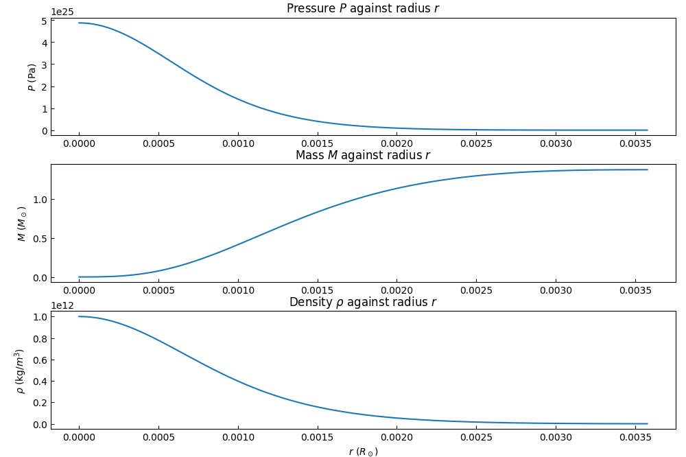
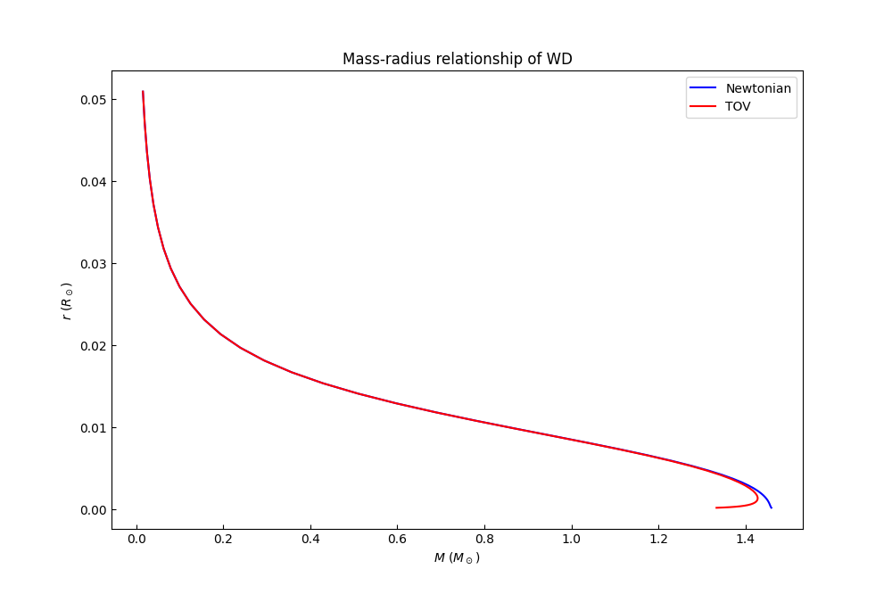

# Modelling of Compact Stellar Structure

## About

This program solves the stellar structure of a compact star using corresponding equations of state (EOS) and non-linear ordinary differential equations (ODEs) describing the hydrostatic equilibrium. The Runge-Kutta fourth order (RK4) method, a simple yet efficient numerical tool, is used to solve the ODEs.

Given the initial condition of the core density, this program numerically calculates the pressure (P), enclosed mass (m) and density (rho) at various radius (r).

## Theory

For the modelling of a star, we make the following assumptions:
* static (non-rotating)
* perfect fluid (characterised by rest frame mass density and isotropic pressure)
* spherically symmetric (i.e. the properties of the stellar matter depend only on the distances from the centre of the star)
* any effects of magnetic field are not significant

For a white dwarf (WD), its EOS is modelled as [a combination of relativistic (rel) and non-relativistic degenerate electron gas](http://astronomy.nmsu.edu/jasonj/565/docs/09_10.pdf). The hydrostatic equilibrium ODEs depend on rho, M and r - [dm/dr and d(rho)/dr](http://astronomy.nmsu.edu/jasonj/565/docs/09_17.pdf). The latter can be expressed in a simple Newtonian form or the more rigorous [Tolman-Oppenheimer-Volkoff equation](https://en.wikipedia.org/wiki/Tolman%E2%80%93Oppenheimer%E2%80%93Volkoff_equation).

Other stellar models (like a main-sequence star or a neutron star) can be easily modelled by changing the corresponding equations of state.

## Documentation

This program is written in Python 3.9.0 on Windows, although it should run on other Python versions or operating systems.

To install the used packages:

```python
make
```
or
```python
make init
```

To plot the P-r, m-r and rho-r relations of a white dwarf given initial core density (default as 1e9 g/cm^3),
```python
make solveWD
```

To plot the mass-radius (MR) relation of a white dwarf,
```python
make MR_WD
```

## Output

An example of the properties of a WD:
<p align="center">
    
</p>

The MR-relation of a WD:
<p align="center">
    
</p>